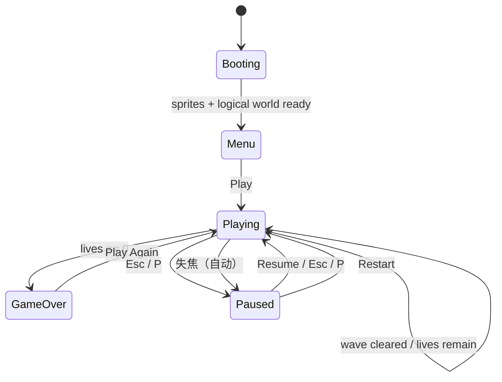
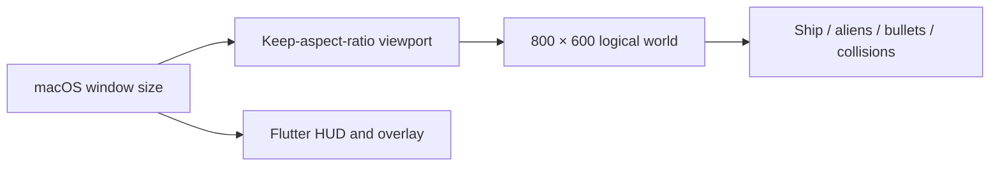
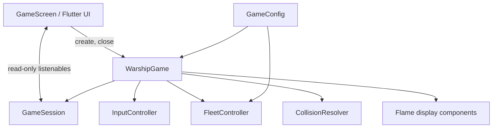
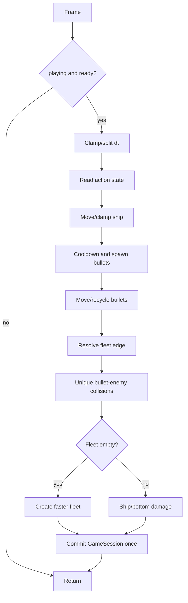
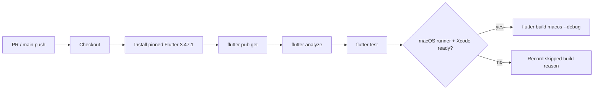

# Warship 产品与技术规格

> 工程：`warship_flutter`
>
> 版本：**v1.1 — 稳定性与可演进性**
>
> 状态：**已完成验收（As-Built）—— 本文所有非 [提议] 条目均已实现并通过测试**
>
> 更新：2026-10-09（实施状态复核）
>
> 平台：macOS 桌面端；Flutter 3.47.1 / Dart 3.13.1 / Flame 1.38.1

## 0. 阅读规则与变更摘要

本版直接替代 v1.0 的 as-built 文档，作为后续开发、测试、评审的唯一实施基线。

### 0.1 两套标记

本文对每一条需求同时标注两件事：**它是怎么来的**，以及**它现在做完没有**。

**① 变更性质** —— 这条需求是怎么来的：

| 标记 | 定义 |
| --- | --- |
| **[已实现]** | 当前代码已经提供，实施时不得回归。 |
| **[修订]** | 对 v1.0 的行为描述或已确认缺陷的修正。 |
| **[新增]** | v1.1 必须完成的需求。 |
| **[提议]** | 后续候选项，不属于 v1.1 交付。 |
| **[批准扩展]** | 原标为 [提议]，经产品批准后提前纳入本轮范围（**音效**、**暂停**）。 |

**② 实施状态** —— 这条需求现在做完没有：

| 标记 | 定义 |
| --- | --- |
| ✅ **已完成** | 代码已实现，且有自动化测试覆盖。 |
| 🔶 **部分完成** | 主体已实现，但规格中的附加条件（例如"可配置"）未做。 |
| ⬜ **未开始** | 尚未实现。 |
| ➖ **不适用** | 不属于当前交付范围。 |

### 0.2 实施状态总览

> **这是"哪些做了、哪些没做"的唯一对照表。** 下文各章节中的每一条需求都带有同样的状态标记，两处应当始终一致。

| 章节 | 需求 | 变更性质 | 实施状态 |
| --- | --- | --- | --- |
| §1 | 菜单、开始/重开、键盘移动、连发、舰队、生命、计分、内存最高分、HUD、结束遮罩 | [已实现] | ✅ 已完成 |
| §1 | 交付平台仅 macOS（不宣称移动端支持） | [修订] | ✅ 已完成 |
| §1 | 移动端：触摸 / 手柄 / 多平台工程 | [提议] | ➖ 不适用 |
| §2 | 状态机 `menu / playing / gameOver` | [已实现] | ✅ 已完成 |
| §2 | `paused` 状态（`Esc` / `P`） | **[批准扩展]** | ✅ 已完成 |
| §2.1 | 对局规则 1–7 | [已实现] + [修订] | ✅ 已完成 |
| §2.2 | 输入按"按下键集合"计算、别名不互相覆盖、左右抵消、输入清理 | [新增] P1 | ✅ 已完成 |
| §2.2 | 暂停键 `Esc` / `P`（边沿触发） | **[批准扩展]** | ✅ 已完成 |
| §3.1 | 不可变 `GameConfig` 集中全部规则常量 | [新增] | ✅ 已完成 |
| §3.1 | 敌人速度上限 | [提议] | ⬜ 未开始（待产品定值） |
| §3.2 | 固定逻辑画布 800×600 | [新增] P1 | ✅ 已完成 |
| §3.2 | letterbox 等比留边、不拉伸逻辑世界 | [新增] P1 | ✅ 已完成 |
| §3.2 | 最小物理窗口 480×360 | [新增] 建议项 | ✅ 已完成 |
| §3.2 | resize 不重排 / 不下移 / 不损坏舰队 | [新增] P1 | ✅ 已完成 |
| §3.2 | HUD/遮罩在真实窗口布局、不被 letterbox 裁切 | [新增] | ✅ 已完成 |
| §3.3 | `dt` 限幅（`maxStepSeconds = 1/20 s`） | [新增] | ✅ 已完成 |
| §3.3 | 舰队边界回夹（不再"越界后只反向"） | [修订] P2 | ✅ 已完成 |
| §4 | 拆分 `GameSession`/`InputController`/`FleetController`/`CollisionResolver`/`GameConfig` | [修订] P3 | ✅ 已完成 |
| §4.1 | 同步提交，不依赖 `WidgetsBinding.addPostFrameCallback` | [新增] P2 | ✅ 已完成 |
| §4.2 | 幂等 `close()` + 由 `GameScreen.dispose()` 释放 | [新增] P2 | ✅ 已完成 |
| §4.2 | 失焦自动暂停 | **[批准扩展]** | 🔶 部分完成（自动暂停已有，"可配置"未做） |
| §5 | 唯一命中：一个敌人一帧只销毁、计分一次 | [新增] P1 | ✅ 已完成 |
| §6 | 确定性就绪信号（移除固定 500ms sleep） | [新增] | ✅ 已完成 |
| §6 | 验收用例 T01–T11 | [新增] | ✅ 已完成 |
| §6 | 验收用例 T12（暂停 / 恢复，本轮新增） | **[批准扩展]** | ✅ 已完成 |
| §7 | CI（analyze / test / lockfile / macOS build） | [新增] | ✅ 已完成 |
| §7 | CI 中的 `dart format` 格式检查 | [提议] | ⬜ 未开始 |
| §7 | README | [新增] P3 | ✅ 已完成 |
| §7 | 音频 `flame_audio` + 静音开关 | **[批准扩展]** | ✅ 已完成 |
| §7 | 最高分持久化 `shared_preferences` | [提议] | ⬜ 未开始 |
| §9 v1.2 | 最高分持久化 | [提议] | ⬜ 未开始 |
| §9 v1.3 | 敌人开火 / 道具 / 难度上限 | [提议] | ⬜ 未开始 |
| §9 v2.0 | 多敌人 / Boss / 特效 / 排行榜 | [提议] | ⬜ 未开始 |

**v1.1 结论**：除 [提议] 项外**全部完成**；T01–T12 全部通过（共 140 个自动化测试）；
`flutter analyze` 零问题；`flutter build macos --debug` 成功，应用可正常启动与运行。

### 0.3 优先级与完成情况

| 优先级 | 变更 | 完成目标 | 实施状态 |
| --- | --- | --- | --- |
| P1 | 唯一命中结算 | 每个敌人每帧只销毁、计分一次。 | ✅ 已完成 |
| P1 | 输入和失焦 | A/←、D/→ 同时使用正确；切换窗口后无粘键。 | ✅ 已完成 |
| P1 | 固定逻辑画布 | resize 不改变规则坐标，不引发越界或连续掉命。 | ✅ 已完成 |
| P2 | 生命周期和状态同步 | 释放后无悬挂通知；状态有确定、可测试的时序。 | ✅ 已完成 |
| P2 | 边界与测试 | 大 `dt`、高波次仍正确回边；测试验证结果。 | ✅ 已完成 |
| P3 | 架构与工程化 | 明确模块、配置、README、CI。 | ✅ 已完成 |

---

## 1. 产品范围

Warship 是一款单机复古太空射击游戏：玩家控制底部飞船左右移动并连续射击，清除持续下压的敌人舰队来获得高分。

| 范围 | 内容 | 实施状态 |
| --- | --- | --- |
| **[已实现]** | 菜单、开始/重开、键盘移动、连发、舰队、生命、计分、内存最高分、HUD、结束遮罩。 | ✅ 已完成（不得回归） |
| **[新增] v1.1** | 本文全部 [新增]/[修订] 项，除非另标 [提议]。 | ✅ 已完成 |
| **[批准扩展]** | 音效与静音、暂停与失焦自动暂停（原为 [提议]，产品批准后提前交付）。 | ✅ 已完成 |
| 不在 v1.1 | Android/iOS/Web/Windows/Linux、触摸/手柄、联网、账号、排行榜。 | ➖ 不适用 |
| **[提议]** | 最高分持久化、敌人攻击、道具、Boss、敌人速度上限。 | ⬜ 未开始 |

**[修订] ✅** 仅存在 `macos/` 宿主工程；“Flutter 可跨平台”不等于当前产品支持移动端。

非功能目标：正常 resize、失焦和恢复后不崩溃；所有规则基于固定逻辑坐标；核心规则可在无窗口测试；状态与资源所有权明确。 **→ ✅ 全部达成。**

---

## 2. 状态与用户流程



| 状态 | 世界规则 | UI | 输入 | 实施状态 |
| --- | --- | --- | --- | --- |
| `booting` | 不运行 | 可显示加载态 | 忽略 | ✅ 已完成 |
| `menu` | 不运行；可显示预生成舰队 | Alien Invasion + Play | Play | ✅ 已完成 |
| `playing` | 移动、射击、碰撞、计分 | HUD | 左、右、射击、暂停 | ✅ 已完成 |
| `gameOver` | 不运行 | Game Over、最终分数、Play Again | Play Again | ✅ 已完成 |
| `paused` | 不运行（世界完全冻结） | 暂停菜单（Paused / Resume / Restart） | 恢复/重开/暂停键 | ✅ 已完成 **[批准扩展]** |

**[已实现] ✅** `GameState` 现为 `menu / playing / paused / gameOver` 四态。
（原文曾写明"暂停获批前不得提前添加 `paused`"；**暂停现已由产品批准**，故正式加入。）

### 2.1 对局规则

1. 新局重置分数、生命、速度、方向、冷却和输入；当前进程最高分保留。 **✅**
2. 飞船位于底部中央，水平范围为 `[0, logicalWidth - shipWidth]`。 **✅**
3. 子弹从飞船顶部中心生成，向上移动，完全离开顶部时回收。 **✅**
4. 敌人以矩阵生成；整队横向移动，触及边界后反向并下移。 **✅**
5. 一颗子弹最多命中一个敌人；**[修订] 一个敌人一帧最多结算一次**。 **✅**
6. 舰队清空后提高速度并创建下一波。 **✅**
7. 飞船碰敌人或敌人到达底边时，一帧最多掉一条命；有命时清屏和重建，生命为 0 转入 `gameOver`。 **✅**

**[批准扩展]** 暂停期间以上 1–7 条**全部不推进**：不改变分数、生命与任何实体坐标。 **✅**

### 2.2 输入契约

| 动作 | 键 | 契约 | 实施状态 |
| --- | --- | --- | --- |
| 左移 | `ArrowLeft` 或 `A` | 任一对应键保持按下即左移。 | ✅ 已完成 |
| 右移 | `ArrowRight` 或 `D` | 任一对应键保持按下即右移。 | ✅ 已完成 |
| 射击 | `Space` | 按住，按冷却连续发射。 | ✅ 已完成 |
| 暂停 / 恢复 | `Esc` 或 `P` | **边沿触发**：只在按下瞬间切换一次。 | ✅ 已完成 **[批准扩展]** |

**[新增] ✅** 输入控制器必须按“当前按下键集合”计算动作，不能让其中一个别名 key-up 覆盖另一个仍按下的键。左右同时按住时速度为 0。窗口/Flutter 焦点丢失、进入非 `playing`、暂停、重开和销毁时必须清空全部输入。未列出的键不得被消费。

**[批准扩展] ✅** 暂停键不参与"按住型动作"：它不进入 `heldKeys`，
长按产生的 `KeyRepeatEvent` 与抬起事件都不会触发切换，避免来回抖动。

**[批准扩展] ✅** 失焦除清空输入外，还会**自动暂停**（`Playing → Paused`）；
但**不自动恢复** —— 恢复必须由玩家显式触发。

---

## 3. 配置、逻辑画布与时间

### 3.1 GameConfig

**[新增] ✅** 所有规则常量置于不可变 `GameConfig`（或等价的命名常量集合）；不得散落在 update 或组件构造函数中。

| 参数 | 值 | 单位 | 实施状态 |
| --- | ---: | --- | --- |
| 逻辑画布 | 800 × 600 | logical px | ✅ 已完成 |
| 飞船 / 敌人 / 子弹尺寸 | 64×48 / 48×40 / 4×12 | px | ✅ 已完成 |
| 飞船 / 子弹速度 | 420 / 520 | px/s | ✅ 已完成 |
| 敌人初速 / 每波加速 | 90 / 10 | px/s | ✅ 已完成 |
| 敌人下移 | 30 | px | ✅ 已完成 |
| 射击冷却 | 0.28 | s | ✅ 已完成 |
| 单敌人分值 / 初始生命 | 50 / 3 | 分 / 条 | ✅ 已完成 |
| 飞船底边距 | 20 | px | ✅ 已完成 |
| **[提议]** 敌人速度上限 | 产品决定 | px/s | ⬜ 未开始（待产品定值） |

> 原 v1.0 中散落的魔法数字（射击冷却、飞船底边距、每波加速、子弹尺寸）
> 现已全部提为 `GameConfig` 的具名常量。 **✅**

### 3.2 固定逻辑画布

**[新增，P1] ✅** 游戏规则永远在 **800×600 logical px** 内运行。实际 macOS 窗口仅决定显示 viewport，不能改变实体坐标或碰撞边界。



实现要求：

1. ✅ 使用 Flame 1.38.1 兼容的固定分辨率 viewport/camera，或行为完全等价的实现。 —— 采用 `CameraComponent.withFixedResolution` + `FixedResolutionViewport`。
2. ✅ 宽高比不匹配时 letterbox/pillarbox，禁止拉伸逻辑世界。 —— 由 viewport 的 `min(scaleX, scaleY)` 与裁剪保证。
3. ✅ 窗口变小时可整体缩小；建议最小物理窗口 480×360。无论尺寸多小，规则边界不得为负数。 —— 已在 `MainFlutterWindow.swift` 设置 `contentMinSize`；`shipMaxX` 另有 `max(0, …)` 防御。
4. ✅ resize 只重算 viewport 与背景表现；不得重排、加速、下移或损坏现存舰队。 —— `onGameResize` 刻意不触碰任何实体。
5. ✅ HUD/遮罩在真实窗口布局，不能被 letterbox 裁切。 —— HUD/遮罩是 Flutter 层，不经过 Flame 的 viewport。

> 关键实现点：`FlameGame.size` 返回 `camera.viewport.virtualSize`，
> 因此装上固定分辨率 viewport 后 `size` 恒为 800×600，与窗口尺寸彻底解耦。 **✅**

### 3.3 帧时间和舰队边界

所有运动用 `distance = speed × dt`。**[新增] ✅** 规则使用的 `dt` 必须限制到配置的最大值（推荐 `1/20 s`），或采用等价固定时间步长；二者选其一并测试。 —— 已实现 `GameConfig.maxStepSeconds = 1/20`，并在单帧入口取 `min(dt, maxStepSeconds)`。

**[修订] ✅** 舰队不得“越界后只反向”。每帧按此顺序处理：

1. ✅ 计算整队左/右边界与目标横向位移；
2. ✅ 若目标越界，把整队移动到恰好接触边界；
3. ✅ 只反转一次方向并下移一次；
4. ✅ 否则应用目标位移；
5. ✅ 再判定碰撞和底边。

> 边界数学被抽成纯函数 `planFleetMove(...)`，因此可以在没有组件树的情况下直接单元测试。 **✅**

---

## 4. 架构与生命周期



| 模块 | 责任 | 实施状态 |
| --- | --- | --- |
| `GameScreen` | Flutter 布局、HUD/遮罩、焦点桥接、创建与释放游戏。 | ✅ 已完成 |
| `WarshipGame` | Flame 生命周期、固定 viewport、单帧协调。 | ✅ 已完成 |
| `GameSession` | 状态、分数、最高分、生命和只读状态通知。 | ✅ 已完成 |
| `InputController` | 键集合转换、动作状态、输入清空。 | ✅ 已完成 |
| `FleetController` | 舰队创建、移动、边界和波次。 | ✅ 已完成 |
| `CollisionResolver` | AABB、唯一命中和伤害裁决。 | ✅ 已完成 |
| Components | 飞船、敌人、子弹的显示与局部数据。 | ✅ 已完成（`components.dart`） |
| `GameConfig` | 不可变数值和尺寸配置。 | ✅ 已完成 |

**[修订，P3] ✅** 可逐步抽取，不要求一次性大重写；但新增系统不得继续无边界堆入 `WarshipGame`。
—— 已在一次交付中完成拆分；`WarshipGame` 现只负责 Flame 生命周期与单帧编排。

### 4.1 状态和 UI 契约

`score`、`highScore`、`lives`、`state` 是游戏层唯一事实来源。UI 只读，不得写入。 **✅**

**[新增，P2] ✅** 一次规则事务提交时，所有对应的只读 listenable 必须同步为可见值；正确性不得依赖 `WidgetsBinding.addPostFrameCallback`。允许一次事务只通知一次，但 listener 读取值必须与已提交游戏事实一致。

> 实现方式：`GameSession` 内部只有一个通知源（单调递增的修订号 `_revision`），
> 四个对外 listenable 都是"读当前字段 + 监听同一通知源"的视图。
> 这样一次事务只发一次通知，且任何 listener 被唤醒时读到的四个值必然彼此一致。 **✅**

### 4.2 生命周期

| 事件 | 必须行为 | 实施状态 |
| --- | --- | --- |
| 屏幕创建 | 创建一个新游戏实例。 | ✅ 已完成 |
| sprites + world ready | 仅初始化一次并进入菜单。 | ✅ 已完成（`onLoad` 有幂等守卫） |
| 失焦 | 清空输入；**并自动暂停**。 | ✅ 已完成 **[批准扩展]** |
| 屏幕释放 | 停止更新、移除监听/组件、释放本游戏拥有的 notifier/资源。 | ✅ 已完成 |
| 延后任务 | 可取消，或游戏关闭后安全无操作。 | ✅ 已完成 |

必须提供幂等公开释放入口（例如 `close()`），并由 `_GameScreenState.dispose()` 调用。禁止多个层级重复 dispose 同一对象。 **✅ 已完成**

> 原文档写"失焦 → 清空输入；暂停为后续提议"；
> **暂停获批后该行已升级为"清空输入 + 自动暂停"**。

---

## 5. 单帧流程和唯一碰撞



**[新增，P1] ✅** 碰撞须用集合或等价唯一标记：

```text
bulletsToRemove = Set<Bullet>()
aliensToRemove = Set<AlienEnemy>()
for each bullet:
  for each unmarked alien:
    if overlaps: mark bullet and alien; break
remove each marked entity once
score += aliensToRemove.length * alienPoints
```

不得以“重复移除通常无害”为理由接受重复计分。 **✅ 已完成** —— 计分严格使用 `aliensToRemove.length`（唯一数量）。

---

## 6. 测试与验收

每次变更必须通过：

```bash
flutter analyze
flutter test
```

**[新增] ✅** 测试不得用固定 `Future.delayed(500ms)` 假定资源已加载。应等待公开 `ready` Future 或注入可控资源加载器。

> 实现说明：由于 flutter_test 的"帧时钟"与"真实异步时钟"互不推进，
> 规则测试改为**确定性驱动** —— 用 `runAsync` 完成真实资源 IO，
> 再用 `stepGame(game, frames:)` 直接驱动 `update`。
> 既没有固定 sleep，也不依赖渲染帧。

| ID | 用例 | 验收结果 | 实施状态 |
| --- | --- | --- | --- |
| T01 | 启动 | ready 后进入 menu，HUD 为 3/0/0。 | ✅ 通过 |
| T02 | 开始/重开 | playing；重开重置对局但保留最高分。 | ✅ 通过 |
| T03 | 唯一命中 | 两颗子弹同帧命中同一敌人，只加 50 分。 | ✅ 通过 |
| T04 | 输入别名 | A+← / D+→ 先松一个，另一个仍维持动作。 | ✅ 通过 |
| T05 | 失焦 | 失焦清空输入，恢复后不自动移动/射击。 | ✅ 通过（并新增"失焦自动暂停"断言） |
| T06 | resize | 世界仍 800×600，实体与舰队不异常。 | ✅ 通过 |
| T07 | 极小窗口 | 无 clamp 异常、负边界或连续掉命。 | ✅ 通过 |
| T08 | 大 dt/高波次 | 舰队回夹、反向、下移各一次，留在边界内。 | ✅ 通过 |
| T09 | 掉命/结束 | 一帧最多一命；第三次后 HUD 0 和 Game Over。 | ✅ 通过 |
| T10 | 状态时序 | 规则提交后 listener 值与游戏事实一致。 | ✅ 通过 |
| T11 | 释放 | close 后无通知、未捕获异常或悬挂监听。 | ✅ 通过 |
| T12 | 暂停/恢复 **[批准扩展]** | Esc/P 切换；暂停时分数、生命与所有坐标不变；长按不抖动。 | ✅ 通过（本轮新增） |

测试分层：纯 Dart（Session/Input/Fleet/Collision）、Flame 集成（资源/组件/帧）、Flutter Widget（HUD/遮罩/焦点）、macOS 构建验证。 **✅ 四层均已覆盖**

**当前实测结果**：`flutter analyze` 零问题；`flutter test` 140 个用例全部通过；
`flutter build macos --debug` 成功；应用可正常启动并稳定运行。

---

## 7. 基础设施与工程要求

| 项目 | 方案 | v1.1 | 实施状态 |
| --- | --- | --- | --- |
| viewport、组件 | Flame（现有） | 是；实现前确认 1.38.1 API。 | ✅ 已确认并采用 |
| 测试 | `flutter_test`（现有） | 是。 | ✅ 已完成 |
| CI | GitHub Actions 或等价 CI | **[新增] 是。** | ✅ 已完成（`.github/workflows/ci.yml`） |
| 最高分存储 | `shared_preferences` | [提议] 否。 | ⬜ 未开始 |
| 音频 | `flame_audio` | [提议] 否。 | ✅ **已完成 [批准扩展]**（`flame_audio 2.12.2` + 静音开关） |

~~不要为未获批功能提前新增持久化或音频依赖。~~
→ **[修订]** 音频已获批准并实现；**持久化仍未获批，依赖也仍未引入。** 该约束对持久化继续有效。



CI 规则：分析和测试是 PR 必需检查；macOS build 在已完成 Xcode 首次启动/许可的 runner 运行；修改 `pubspec.yaml` 必须更新 `pubspec.lock`；不得提交 `build/`、`.dart_tool/` 或 ephemeral 生成物。 **✅ 已全部编入 workflow**

**[新增，P3] ✅** README 至少说明：项目/平台、Flutter 前提、运行和测试命令、键盘控制、目录、本文档链接及 Xcode 前置条件。 —— 已全部覆盖，并补充了暂停/失焦行为与音效说明。

---

## 8. 实施顺序与完成定义

1. ✅ 建立 `GameConfig`、固定 logical world、确定性 ready 信号。
2. ✅ 完成输入控制器、失焦桥接和 T04/T05。
3. ✅ 完成边界回夹、唯一碰撞、T03/T06/T07/T08。
4. ✅ 完成 `GameSession` 同步提交、`close()`、T10/T11。
5. ✅ 逐步拆分协调器职责，更新 README 和 CI。

v1.1 完成条件：所有非 [提议] 新需求实现；T01–T11 通过；本地和 CI 的 analyze/test 为绿；已准备好的 macOS 环境可 debug build；README 与本文件匹配；代码审查无未声明架构例外。

**→ ✅ 以上条件全部满足。** 另附本轮批准扩展项（音效、暂停、T12）一并交付。

## 9. 后续路线（非 v1.1）

| 版本 | 候选能力 | 前置条件 | 实施状态 |
| --- | --- | --- | --- |
| v1.2 | ~~暂停~~、最高分持久化、~~音效~~ | v1.1 状态、生命周期、CI 稳定。 | 🔶 暂停与音效**已提前交付**；**最高分持久化未开始** |
| v1.3 | 敌人开火、道具、难度上限 | 受伤/敌方子弹规则有充分测试。 | ⬜ 未开始 |
| v2.0 | 多敌人、Boss、特效、排行榜 | 另立玩法、数据和跨平台规格。 | ⬜ 未开始 |

### 9.1 剩余待办（本轮未完成项汇总）

| 项 | 原标记 | 说明 |
| --- | --- | --- |
| 最高分持久化 | [提议] | 引入 `shared_preferences`；启动读取、结算写入；失败不阻塞对局。 |
| 敌人速度上限 | [提议] | 规格标注"产品决定"，需先拍板数值。 |
| 敌人开火 | [提议] | 需要敌方子弹与受伤规则的完整测试。 |
| 道具 | [提议] | 护盾 / 多倍射击等。 |
| 难度曲线重构 | [提议] | 速度上限 + 敌人类型 / 开火频率，替代无限加速。 |
| 多敌人类型 / Boss / 特效 / 排行榜 | [提议] | v2.0 范畴。 |
| 移动端（触摸 / 手柄 / 多平台工程） | [提议] | 不在当前交付范围。 |
| CI 的 `dart format` 检查 | [提议] | 现有 CI 已含 analyze / test / lockfile / macOS build。 |
| 失焦自动暂停的"可配置"开关 | [批准扩展] | 自动暂停已实现；设置开关未做。 |

---

## 附录 A：目标文件责任

```text
lib/
  main.dart                    Flutter UI、焦点和释放桥接、HUD/遮罩/暂停菜单
  game/warship_game.dart       Flame 场景与帧协调（固定 viewport、暂停控制）
  game/game_config.dart        [新增] 配置
  game/game_session.dart       [新增] 状态/计分/生命
  game/input_controller.dart   [新增] 输入
  game/fleet_controller.dart   [新增] 舰队
  game/collision_resolver.dart [新增] 碰撞
  game/components.dart         [新增] 飞船/敌人/子弹显示组件
  game/game_audio.dart         [批准扩展] 音效服务（含静音与失败降级）
assets/
  images/                      ship.png / alien.png
  audio/                       shoot / hit / life_lost / game_over（原创合成）
test/                          第 6 节确定性测试（unit / game / widget / support）
tool/
  generate_audio.dart          音效生成器（可复现资产）
.github/workflows/ci.yml       [新增] CI
Spec/Warship产品设计.md         唯一实施基线（本文件）
Spec/代码审查反馈.md             审查证据
Spec/Warship产品设计（审阅修订版）.md  审阅修订版说明
```

可以用多个小 PR 完成结构拆分，但每个 PR 必须保持可运行、可测试，并遵守本文行为契约。 **✅**

## 附录 B：实施状态标记速查

| 想确认的事 | 看哪里 |
| --- | --- |
| 一共做了哪些、还剩哪些 | **§0.2 实施状态总览** |
| 每条需求的详细状态 | 各章节表格末列的"实施状态" |
| 还没做的完整清单 | **§9.1 剩余待办** |
| 验收用例是否通过 | **§6 测试与验收**（T01–T12） |
| 如何运行与验证 | `README.md` |
