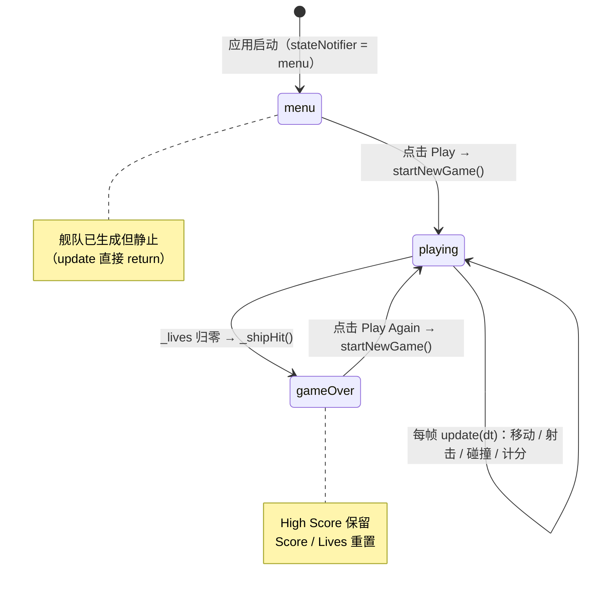
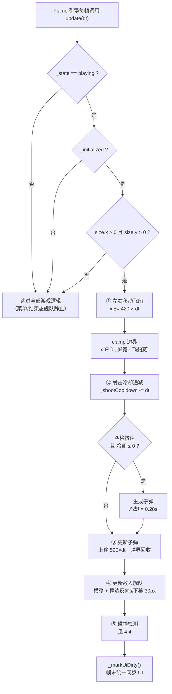
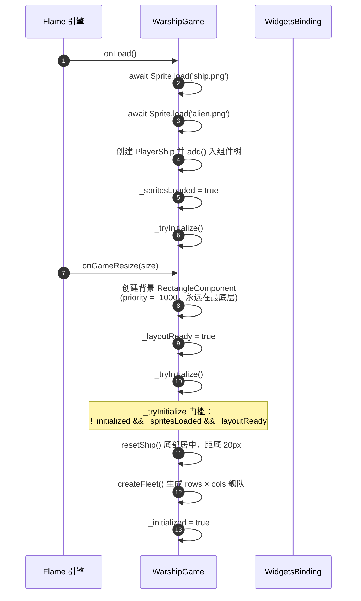
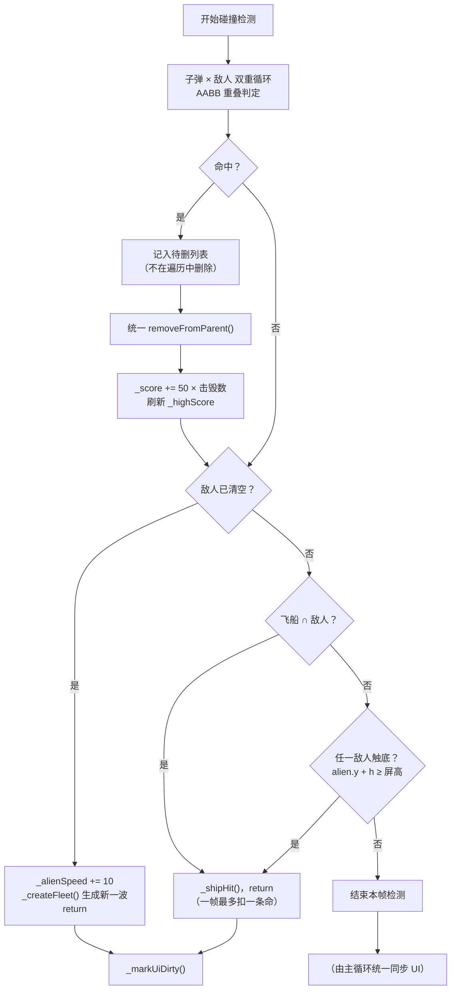
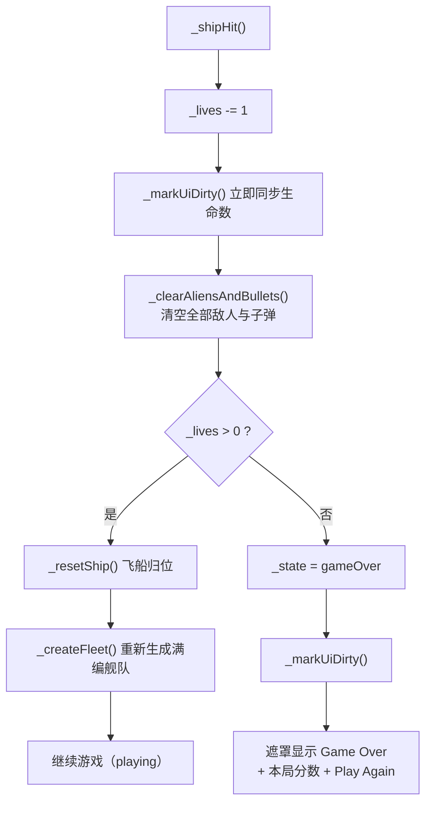
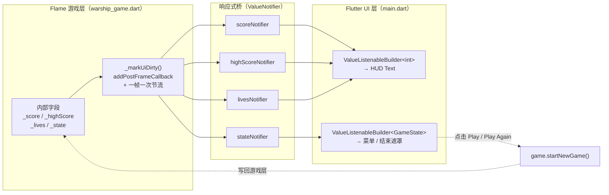
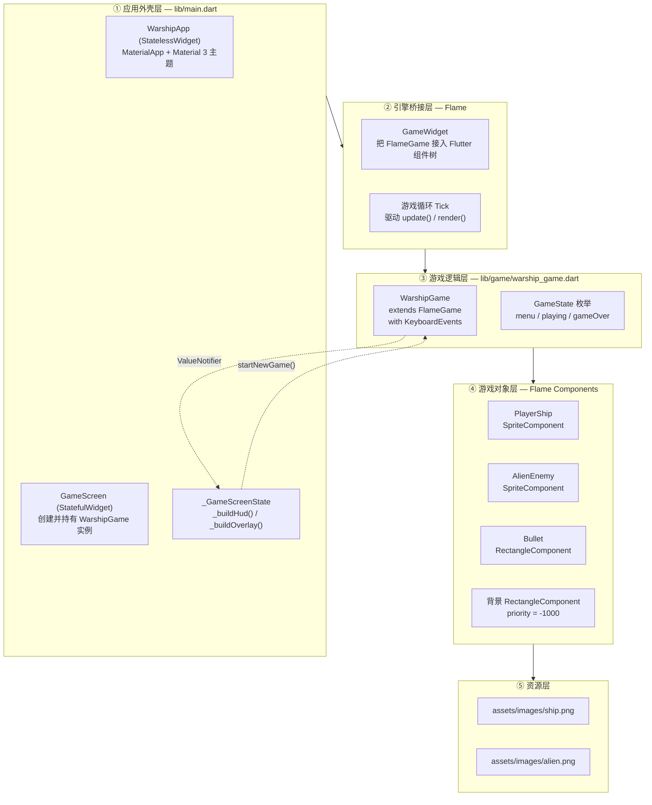
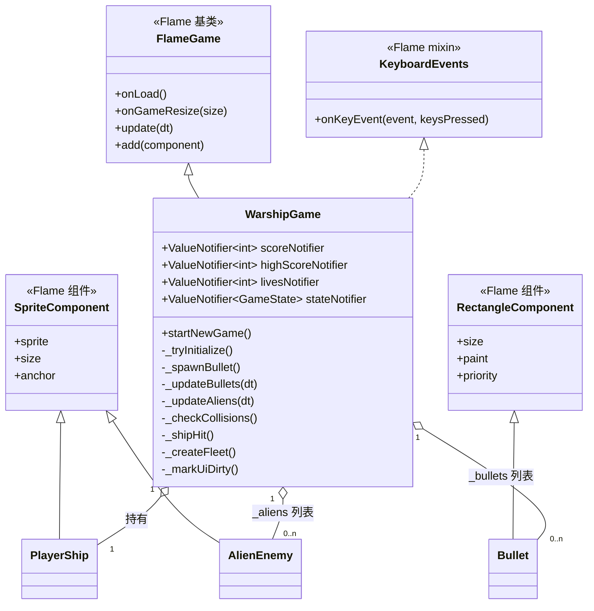
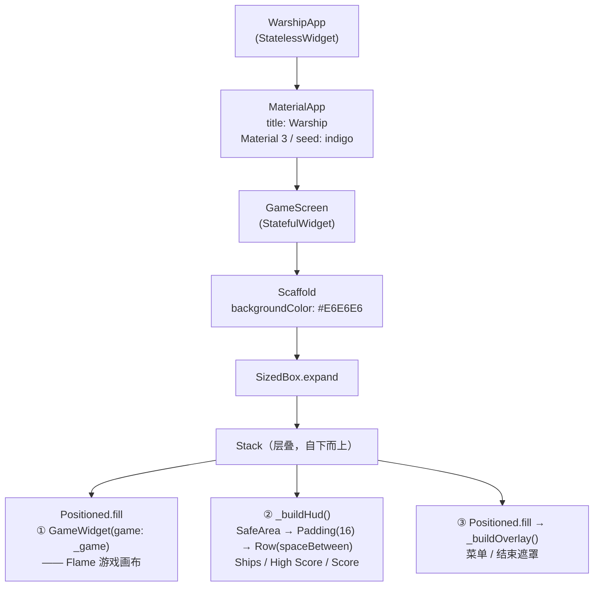
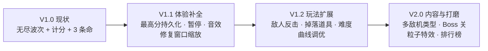

# Warship 产品设计文档（Product Spec）

> **项目代号**：Warship（游戏内标题 *Alien Invasion*）
> **工程名**：`warship_flutter`
> **文档版本**：v1.0
> **文档状态**：已实现（As-Built Spec）— 本文档依据仓库现有代码反向整理，描述的是**当前真实行为**，并标注了已知限制与迭代建议
> **技术栈**：Flutter 3.47.1 / Dart 3.13.1 + Flame 1.38.1
> **目标平台**：macOS 桌面端（当前仅存在 `macos/` 平台工程）
> **入口文件**：`lib/main.dart`
> **核心逻辑**：`lib/game/warship_game.dart`

---

## 目录

1. [产品概述](#1-产品概述)
2. [场景（Scenarios）](#2-场景scenarios)
3. [核心功能（Core Features）](#3-核心功能core-features)
4. [流程图（Flowcharts）](#4-流程图flowcharts)
5. [核心组件（Core Components）](#5-核心组件core-components)
6. [数值参数表](#6-数值参数表)
7. [输入映射表](#7-输入映射表)
8. [状态与表现对照表](#8-状态与表现对照表)
9. [验收与测试覆盖](#9-验收与测试覆盖)
10. [已知限制与迭代建议](#10-已知限制与迭代建议)
11. [附录：迁移修复与环境记录](#11-附录迁移修复与环境记录)

---

## 1. 产品概述

### 1.1 一句话定位

一款**单机、键盘操作、无尽波次**的复古太空射击小游戏：玩家操控一艘飞船在屏幕底部左右移动并向上射击，清除一波波下压的外星舰队，尽可能拿到更高分数。

### 1.2 产品背景

本项目由作者早前的一个 **Python 版本**重写而来（见 `README.md`：*"Small game with warship, which is re-writted from Python."*），重写目标是：

- 用 **Flutter + Flame** 替换原 Python 实现，获得跨平台渲染与原生窗口能力；
- 用 Flame 的**组件树（Component Tree）**模型替代手写绘制循环；
- 用 Flutter 的 **ValueNotifier / ValueListenableBuilder** 让 UI 与游戏逻辑解耦。

### 1.3 目标用户与使用场景

| 维度 | 描述 |
| --- | --- |
| 目标用户 | 开发者本人 / 学习 Flame 引擎的开发者 / 需要 5 分钟内可上手的休闲玩家 |
| 使用场合 | 桌面端碎片时间游玩；作为 Flame + Flutter 混合架构的教学样例 |
| 单局时长 | 30 秒 ~ 数分钟（取决于操作水平，难度随波次递增无上限） |
| 操作门槛 | 极低：仅需「左 / 右 / 射击」三个按键 |

### 1.4 设计原则

1. **逻辑与表现分离**：`WarshipGame` 负责规则（移动、碰撞、计分），`main.dart` 只负责"长什么样"。
2. **数据单向流动**：游戏内部字段是唯一真相源（Source of Truth），UI 只读不写。
3. **帧率无关**：所有位移计算乘以 `dt`，30fps 与 120fps 下手感一致。
4. **零配置启动**：无后端、无账号、无网络请求，启动即玩。
5. **常量集中**：所有手感参数以 `static const` 集中在 `WarshipGame` 顶部，便于统一调参。

---

## 2. 场景（Scenarios）

### S1 — 首次启动：进入主菜单

| 项 | 内容 |
| --- | --- |
| **角色** | 玩家 |
| **前置条件** | 应用已启动，图片资源 `ship.png` / `alien.png` 加载完成，画布尺寸已就绪 |
| **触发** | 打开应用 |
| **主流程** | 1. `main()` → `runApp(WarshipApp)`<br>2. 构建 `GameScreen`，`initState` 中创建 `WarshipGame`<br>3. Flame 执行 `onLoad()` 加载精灵 → 执行 `onGameResize()` 建立背景<br>4. 两个条件齐备后 `_tryInitialize()`：飞船归位 + 生成第一波舰队<br>5. `stateNotifier` 为 `menu`，遮罩层显示大标题 **"Alien Invasion"** 与 **Play** 按钮 |
| **画面表现** | 浅灰背景（`#E6E6E6`）+ 底部居中飞船 + 顶部外星舰队（静止不动）+ 半透明黑色遮罩 `black45` |
| **验收** | 显示 "Alien Invasion" 与 "Play"；HUD 显示 `Ships: 3`、`High Score: 0`、`Score: 0`；菜单状态下舰队静止（`update` 直接 return） |

> **注意**：菜单状态下舰队会被预先绘制出来作为"背景装饰"，但**不会移动**——因为 `update()` 在 `state != playing` 时直接返回。

### S2 — 开始一局游戏

| 项 | 内容 |
| --- | --- |
| **触发** | 点击遮罩上的 **Play**（或结束画面的 **Play Again**）按钮 |
| **主流程** | 调用 `startNewGame()`：<br>1. 重置 `_score = 0`、`_lives = 3`、`_alienSpeed = 90`、`_alienDirection = 1`、`_shootCooldown = 0`<br>2. 清空按键状态（左 / 右 / 空格）<br>3. 若已初始化：清空旧敌人与子弹 → 飞船归位 → 重新生成舰队<br>4. `_state = playing`，`_markUiDirty()` 通知 UI<br>5. 遮罩层收到 `playing` 后返回 `SizedBox.shrink()`，遮罩消失 |
| **验收** | 遮罩消失；`Ships: 3`、`Score: 0`；舰队开始横向移动 |

### S3 — 移动飞船（左右走位）

| 项 | 内容 |
| --- | --- |
| **触发** | 按住 `←` / `A` 或 `→` / `D` |
| **主流程** | 1. `onKeyEvent` 收到 `KeyDownEvent` 将对应标志位置 `true`，`KeyUpEvent` 置 `false`<br>2. 每帧 `update()` 中按 `±420 px/s × dt` 修改 `_ship.x`<br>3. 用 `clamp(0, size.x - shipWidth)` 限制在屏幕内 |
| **异常/边界** | 同时按住左右键时：代码顺序先处理左移再处理右移，两者都会生效，净效果为**先左后右相互抵消**（位移量取决于帧内顺序，实际表现为原地抖动/近似静止） |
| **验收** | 飞船不会移出屏幕左右边界；长按移动顺滑无卡顿 |

### S4 — 射击（含射速限制）

| 项 | 内容 |
| --- | --- |
| **触发** | 按住 `空格` |
| **主流程** | 1. `_shootCooldown` 每帧减去 `dt`<br>2. 当 `_spacePressed == true` 且 `_shootCooldown <= 0` 时发射<br>3. 在飞船炮口位置生成 `4×12` 的黑色矩形子弹，初始位置 `(ship.x + shipWidth/2 - 2, ship.y - 12)`<br>4. 发射后 `_shootCooldown = 0.28` 秒 |
| **设计要点** | 冷却机制把射速锁定为约 **3.6 发/秒**，避免"每帧一发"导致弹幕失衡；子弹是**按住自动连发**，无需狂点 |
| **清理规则** | 子弹每帧上移 `520 px/s × dt`；当 `bullet.y < -bullet.height`（完全飞出顶部）时从组件树与列表移除 |
| **验收** | 按住空格产生稳定的等间隔连发；子弹飞出屏幕后被回收，长时间游戏不会内存增长 |

### S5 — 击落敌人得分

| 项 | 内容 |
| --- | --- |
| **触发** | 子弹与敌人矩形重叠（AABB 判定） |
| **主流程** | 1. 双重循环遍历 `子弹 × 敌人`<br>2. 命中后把子弹与敌人分别记入待删列表（**不在遍历中删除**，避免下标错乱）<br>3. 统一 `removeFromParent()` 并移出列表<br>4. `_score += 50 × 命中数`<br>5. 若 `_score > _highScore` 则刷新最高分<br>6. `_markUiDirty()` 通知 UI |
| **验收** | 敌方消失、子弹消失、`Score` 增加 50 的整数倍、`High Score` 同步追踪当前最高分 |

### S6 — 被击中 / 敌人触底 → 扣命并清屏

| 项 | 内容 |
| --- | --- |
| **触发** | ① 飞船与敌人重叠 ② 任一敌人触达屏幕底边（`alien.y + alien.height >= size.y`） |
| **主流程** | 见 [`_shipHit` 流程图](#47-掉命与结算流程_shiphit) |
| **关键规则** | - 一帧内**最多只扣一条命**（命中后立即 `return`，终止本帧剩余碰撞检测）<br>- 扣命后**清空全部敌人与子弹**（类似"清屏重来"），而不是让舰队继续在原位推进<br>- 若 `_lives > 0`：飞船归位 + **重新生成一整队满编敌人**<br>- 若 `_lives == 0`：`_state = gameOver` |
| **设计取舍** | 清屏重置是对玩家的"宽容处理"：被击中后不会立刻在残局中连续掉命；代价是节奏被打断、且敌人位置重置会削弱上一波推进的压迫感 |
| **验收** | `Ships` 数字减 1；场上敌人与子弹瞬间清空；飞船回到屏幕底部中央 |

### S7 — 清空一波 → 难度提升

| 项 | 内容 |
| --- | --- |
| **触发** | `_aliens` 列表为空（全部被击落） |
| **主流程** | 1. `_alienSpeed += 10`（初始 90 px/s）<br>2. 调用 `_createFleet()` 生成新一波满编舰队<br>3. `return`，跳过本帧后续碰撞检测 |
| **难度曲线** | 横向速度每清一波 **+10 px/s**，**无上限**。第 N 波的横向速度约为 `90 + 10N` px/s |
| **验收** | 清空后立即出现新舰队，且横向移动明显更快 |

### S8 — 生命耗尽：游戏结束

| 项 | 内容 |
| --- | --- |
| **触发** | `_shipHit()` 中 `_lives` 归零 |
| **主流程** | `_state = gameOver` → `_markUiDirty()` → 遮罩层显示 **"Game Over"** + 本局 `Score` + **Play Again** 按钮 |
| **验收** | 画面变暗、显示结束文案与本局分数；游戏循环停止推进（`update` 因状态判断直接返回）；`High Score` 保留本局最高值 |

### S9 — 再来一局

| 项 | 内容 |
| --- | --- |
| **触发** | 点击 **Play Again** |
| **主流程** | 复用 `startNewGame()`（与 S2 完全相同），最高分**跨局保留**，分数与生命重置 |
| **验收** | 回到 `playing` 状态；`Score: 0`、`Ships: 3`；`High Score` 保持上一局的最好成绩 |

### S10 — 窗口缩放 / 全屏切换

| 项 | 内容 |
| --- | --- |
| **触发** | 拖动窗口边缘或切换全屏 |
| **主流程** | Flame 调用 `onGameResize(size)`：背景 `RectangleComponent` 的 `size` 更新为新的画布尺寸；尺寸 > 0 时标记 `_layoutReady` |
| **验收** | 背景始终铺满窗口，不出现色差边框；飞船与子弹的相对位置保持（绝对值不变） |
| **⚠️ 已知缺陷** | 缩放时**不会重排舰队**、也不会重新校正飞船位置。已有敌人保持原坐标，窗口变小时敌人可能被推到屏幕外或被"卡"在右边界判定上，导致舰队行为异常。见 [§10](#10-已知限制与迭代建议) |

### S11 — 长时间游戏的稳定性

| 项 | 内容 |
| --- | --- |
| **触发** | 连续游戏数分钟 |
| **规则** | 子弹飞出屏幕立即回收；敌人被击落立即从组件树摘除；集合使用"先记录后统一删除"的模式 |
| **验收** | 组件数量收敛，无内存无限增长；无渲染异常抛出 |

---

## 3. 核心功能（Core Features）

### F1 — 游戏状态机（Game State Machine）

- **描述**：以枚举 `GameState { menu, playing, gameOver }` 驱动全局行为的三种形态。
- **规则**：
  - `menu`：舰队静止（装饰性背景），遮罩显示标题与 Play。
  - `playing`：游戏循环全速运转（移动、射击、碰撞、计分）。
  - `gameOver`：游戏循环停止推进，遮罩显示结算与 Play Again。
- **实现要点**：状态只由 `WarshipGame` 修改，通过 `stateNotifier` 单向广播给 UI。
- **验收**：任意时刻状态属于且仅属于三种之一；状态切换后 UI 在一帧内完成刷新。

### F2 — 玩家飞船控制

- **描述**：键盘控制飞船在屏幕底部水平移动。
- **规则**：`←`/`A` 左移，`→`/`D` 右移；速度 `420 px/s`；水平位置限制在 `[0, 屏幕宽 - 飞船宽]`；**垂直方向固定不可移动**。
- **实现要点**：`WarshipGame with KeyboardEvents`，在 `onKeyEvent` 中把按键事件映射为三个布尔标志位（`_leftPressed` / `_rightPressed` / `_spacePressed`），在 `update` 中统一消费。返回 `KeyEventResult.handled` 声明消费该按键，其余返回 `ignored`。
- **验收**：移动速度与帧率无关；飞船不越界。

### F3 — 射击系统

- **描述**：按住空格持续发射子弹。
- **规则**：射速受 `0.28s` 冷却限制；子弹尺寸 `4×12`、颜色纯黑 `#000000`；上升速度 `520 px/s`；从飞船顶部中央偏左 2px 处生成。
- **验收**：射速稳定；子弹越界自动回收。

### F4 — 敌人舰队生成与推进

- **描述**：生成 `行 × 列` 的敌人矩阵，并实现经典"太空侵略者"式整队推进。
- **生成规则**：
  - 列数 `cols = max(1, floor((屏宽 - 2×48) / (2×48)))`
  - 行数 `rows = max(1, floor((屏高 - 3×40 - 48 - 20) / (2×40)))`
  - 敌人坐标：`x = 48 + 96 × col`，`y = 40 + 80 × row`
  - 即**横向与纵向间距都等于敌人尺寸的 2 倍**（一个敌人宽 + 一个空白宽），形成规整网格。
- **推进规则**：整队沿同一方向横向移动；**任一**敌人触及屏幕左右边缘 → 全体**反向** + **整体下移 30px**。
- **验收**：以 800×600 画布为例生成 **7 列 × 5 行 = 35 个敌人**；舰队始终保持网格队形。

### F5 — 碰撞检测（AABB）

- **描述**：轴对齐包围盒（Axis-Aligned Bounding Box）重叠检测，共三类碰撞。
- **判定公式**：
  ```
  a.x < b.x + b.width  &&  a.x + a.width > b.x
  && a.y < b.y + b.height && a.y + a.height > b.y
  ```
- **要点**：飞船与敌人均使用 `Anchor.topLeft`，使 `x/y` 直接就是矩形左上角，公式无需锚点换算。
- **验收**：三类碰撞按优先级顺序处理，一帧最多扣一条命。

### F6 — 计分与最高分

- **描述**：击落一个敌人得 **50 分**；最高分实时追踪当前分数峰值。
- **规则**：`_score += 50 × 本帧击毁数`；`if (_score > _highScore) _highScore = _score`。
- **⚠️ 限制**：最高分**仅存于内存**，应用重启即丢失（见 §10）。

### F7 — 生命与结算

- **描述**：初始 **3 条命**；被撞或敌人触底扣 1 条；归零则游戏结束。
- **验收**：`Ships` HUD 数字与实际一致；归零后进入 `gameOver` 且不再响应游戏逻辑。

### F8 — HUD（抬头显示）

- **描述**：顶部信息条，三段式布局。
- **布局**：`SafeArea`（避开刘海/状态栏）+ 16px 内边距 + `Row(mainAxisAlignment: spaceBetween, crossAxisAlignment: start)`。
- **三段内容**：左 `Ships: n`；中 `High Score: n`；右 `Score: n`。
- **样式**：`Colors.black87`、`fontSize 16`、`FontWeight.w600`。
- **实现要点**：每个数字用独立的 `ValueListenableBuilder` 包裹，**只重建变化的那一个 Text**。

### F9 — 菜单 / 结束遮罩（Overlay）

- **描述**：叠加在游戏画布之上的半透明层，承担"开始"与"结算"两个界面。
- **规则**：
  - `playing` → 返回 `SizedBox.shrink()`（零尺寸，等于隐藏）
  - `menu` → 标题 "Alien Invasion" + **Play**
  - `gameOver` → 标题 "Game Over" + 本局 `Score` + **Play Again**
- **样式**：背景 `Colors.black45`；标题 `white / 42 / bold`；分数 `white / 22`；按钮为 Material 3 `FilledButton`。
- **验收**：状态切换时遮罩正确显示/隐藏；按钮点击即调用 `startNewGame()`。

### F10 — 自适应布局与初始化编排

- **描述**：解决"资源加载"与"画布尺寸就绪"两个**异步且顺序不确定**的事件之间的依赖问题。
- **规则**：使用两个标志位 `_spritesLoaded` 与 `_layoutReady`，任一完成时都调用 `_tryInitialize()`；仅当**两者都为真且尚未初始化**时才执行 `_resetShip()` + `_createFleet()`。
- **价值**：无论 `onLoad` 先返回还是 `onGameResize` 先触发，初始化都恰好执行一次，不会出现"飞船未创建就被布局"或"舰队生成时屏宽为 0"的崩溃。

### F11 — 帧率无关的运动

- **描述**：所有位移都使用 `距离 = 速度(px/s) × dt(秒)`。
- **价值**：无论设备运行在 30fps 还是 120fps，飞船、子弹、敌人的"每秒移动像素数"保持恒定，手感一致。

### F12 — UI 同步节流

- **描述**：游戏内部字段不直接写入 `ValueNotifier`，而是通过 `_markUiDirty()` 延迟到**当前帧渲染结束后**统一同步。
- **规则**：`_uiSyncScheduled` 标志位保证**一帧最多同步一次**；同步动作注册在 `WidgetsBinding.instance.addPostFrameCallback` 中。
- **价值**：一帧内可能多次修改分数（一次击毁多个敌人）、生命、状态，若每次都写 notifier 会触发 UI 多次重建；节流后无论改多少次，UI 每帧只刷新一次。

---

## 4. 流程图（Flowcharts）

### 4.1 全局状态机



### 4.2 单帧游戏主循环（`update`）



### 4.3 初始化时序（`onLoad` + `onGameResize` 汇合）



> **要点**：两个事件**先后顺序不确定**，因此用标志位 + 幂等的 `_tryInitialize()` 收敛，保证初始化恰好执行一次。

### 4.4 碰撞检测决策流（`_checkCollisions`）



### 4.5 掉命与结算流程（`_shipHit`）



### 4.6 游戏逻辑 → UI 的单向数据流（ValueNotifier 桥）



> **闭环说明**：整条链路只有**两个**交互点——游戏层"发通知"，UI 层"调方法"。双方不持有对方引用（除 `GameWidget` 持有 game 实例），实现解耦。

---

## 5. 核心组件（Core Components）

### 5.1 整体架构分层



### 5.2 组件类图



### 5.3 Flutter 组件树（Widget Tree）



### 5.4 组件职责清单

#### 5.4.1 `WarshipGame`（核心）

| 项 | 内容 |
| --- | --- |
| **文件** | `lib/game/warship_game.dart` |
| **继承** | `FlameGame`，混入 `KeyboardEvents` |
| **职责** | 游戏世界的唯一权威：状态机、资源加载、输入处理、游戏循环、碰撞、计分、生命、UI 通知 |
| **对外接口** | `scoreNotifier` / `highScoreNotifier` / `livesNotifier` / `stateNotifier`（只读语义）、`startNewGame()` |
| **生命周期钩子** | `onLoad()`（异步加载精灵）、`onGameResize(size)`（背景与布局就绪）、`update(dt)`（每帧逻辑） |
| **内部状态** | `_score` / `_highScore` / `_lives` / `_state`、`_alienSpeed` / `_alienDirection` / `_shootCooldown`、三个按键标志位、`_spritesLoaded` / `_layoutReady` / `_initialized` / `_uiSyncScheduled` |
| **设计评价** | 类偏"上帝对象"（God Object，约 600 行）：所有规则集中于此，好处是阅读单文件即可理解全部玩法，代价是后续扩展（道具、Boss、音效）需要拆分。见 §10 建议。 |

#### 5.4.2 `PlayerShip`

| 项 | 内容 |
| --- | --- |
| **文件** | `lib/game/warship_game.dart` |
| **继承** | `SpriteComponent` |
| **构造参数** | `sprite`（`ship.png`）、`size`（`64 × 48`） |
| **锚点** | `Anchor.topLeft` — 使 `x/y` 即矩形左上角，简化 AABB 运算 |
| **职责** | **只负责"长什么样"**；位置由 `WarshipGame.update()` 统一驱动 |
| **显示尺寸 vs 资源尺寸** | 资源实际 `60 × 48`，按 `64 × 48` 渲染（横向轻微拉伸） |

#### 5.4.3 `AlienEnemy`

| 项 | 内容 |
| --- | --- |
| **文件** | `lib/game/warship_game.dart` |
| **继承** | `SpriteComponent` |
| **构造参数** | `sprite`（`alien.png`）、`position`（由舰队排列算法计算）、`size`（`48 × 40`） |
| **锚点** | `Anchor.topLeft` |
| **职责** | 纯展示组件；移动、反向、下压、销毁均由 `WarshipGame` 调度 |
| **显示尺寸 vs 资源尺寸** | 资源实际 `60 × 58`（宽高比 ≈ 1.03），按 `48 × 40` 渲染（宽高比 1.20）→ **存在可见的纵向压扁**，建议后续统一宽高比 |

#### 5.4.4 `Bullet`

| 项 | 内容 |
| --- | --- |
| **文件** | `lib/game/warship_game.dart` |
| **继承** | `RectangleComponent` |
| **尺寸** | `4 × 12`（细长竖直矩形） |
| **颜色** | `#000000`（纯黑），通过级联操作符 `Paint()..color = ...` 配置 |
| **设计取舍** | 不使用图片资源 —— 子弹是纯色矩形，用几何绘制比加载贴图更轻量高效，也便于后续改色/改尺寸做道具分级 |

#### 5.4.5 背景 `RectangleComponent`

| 项 | 内容 |
| --- | --- |
| **尺寸** | 始终等于画布 `size`，在 `onGameResize` 中创建或更新 |
| **颜色** | `#E6E6E6`，与 `Scaffold.backgroundColor` 严格一致，避免出现色差边框 |
| **优先级** | `priority = -1000`，确保永远绘制在所有游戏对象之后 |

#### 5.4.6 `WarshipApp` / `GameScreen` / `_GameScreenState`（UI 外壳）

| 组件 | 类型 | 职责 |
| --- | --- | --- |
| `WarshipApp` | `StatelessWidget` | 配置 `MaterialApp`：标题 `Warship`、关闭 DEBUG 横幅、Material 3 主题（seed = `Colors.indigo`）、首页指向 `GameScreen` |
| `GameScreen` | `StatefulWidget` | 承载游戏画面；本身无可变状态，只是为 `_GameScreenState` 提供宿主 |
| `_GameScreenState` | `State<GameScreen>` | 在 `initState` 中创建 `WarshipGame`；`build` 组装三层 `Stack`；提供 `_buildHud()` 与 `_buildOverlay()` |

#### 5.4.7 数据契约：`ValueNotifier` 桥

| Notifier | 类型 | 初值 | 语义 | 消费方 |
| --- | --- | --- | --- | --- |
| `scoreNotifier` | `ValueNotifier<int>` | `0` | 本局当前分数 | HUD 右侧 + 结束画面 |
| `highScoreNotifier` | `ValueNotifier<int>` | `0` | 本次运行期间的最高分 | HUD 中间 |
| `livesNotifier` | `ValueNotifier<int>` | `3` | 剩余生命 | HUD 左侧 |
| `stateNotifier` | `ValueNotifier<GameState>` | `menu` | 游戏状态机 | 遮罩层显隐与内容 |

**约定**：
- UI **只读**这四个 notifier，**从不写入**；
- 游戏层**只写**这四个 notifier，不直接操作 UI；
- 所有写入必须经过 `_markUiDirty()`，以享受"一帧一次"的节流。

### 5.5 文件结构

```
Warship_Flutter/
├── lib/
│   ├── main.dart                    # 应用入口 + UI 外壳（292 行）
│   └── game/
│       └── warship_game.dart        # 游戏核心逻辑 + 3 个组件类（664 行）
├── assets/images/
│   ├── ship.png                     # 玩家飞船精灵（60×48 RGBA）
│   └── alien.png                    # 外星敌人精灵（60×58 RGBA）
├── test/
│   ├── widget_test.dart             # 外壳集成测试：点击 Play + 模拟 120 帧
│   └── game_flow_test.dart          # 游戏规则回归测试（本次新增，5 个用例）
├── Spec/
│   └── Warship产品设计.md            # 本文档
├── macos/                           # macOS 桌面平台工程（唯一平台目标）
├── pubspec.yaml                     # 依赖与资源声明
└── analysis_options.yaml            # flutter_lints，排除各平台目录
```

---

## 6. 数值参数表

所有参数以 `static const` 集中定义在 `WarshipGame` 顶部，便于统一调参。

| 参数 | 常量名 | 值 | 单位 | 说明 |
| --- | --- | --- | --- | --- |
| 飞船移动速度 | `_shipSpeed` | 420 | px/s | 左右移动速率 |
| 子弹上升速度 | `_bulletSpeed` | 520 | px/s | 快于飞船，手感更"利落" |
| 敌人基础横向速度 | `_baseAlienSpeed` | 90 | px/s | 每清一波 +10，无上限 |
| 敌人下压距离 | `_alienDropSpeed` | 30 | px | 每次撞边后整体下移 |
| 单个敌人分值 | `_alienPoints` | 50 | 分 | 击落得分 |
| 飞船尺寸 | `_shipWidth` / `_shipHeight` | 64 / 48 | px | 显示尺寸 |
| 敌人尺寸 | `_alienWidth` / `_alienHeight` | 48 / 40 | px | 显示尺寸 |
| 子弹尺寸 | — | 4 / 12 | px | 硬编码在 `Bullet` 内 |
| 射击冷却 | — | 0.28 | s | 硬编码在 `update` 内 → 约 3.6 发/秒 |
| 初始生命 | — | 3 | 条 | `livesNotifier` 初值 |
| 飞船距底距离 | — | 20 | px | `_resetShip()` 硬编码 |
| 每波加速量 | — | +10 | px/s | 硬编码在 `_checkCollisions` 内 |
| 背景色 | — | `#E6E6E6` | — | 与 Scaffold 背景一致 |
| 子弹色 | — | `#000000` | — | 纯黑 |
| 遮罩色 | — | `black45` | — | 半透明黑 |

> **重构建议**：射击冷却、飞船距底距离、每波加速量目前是散落的"魔法数字"，建议一并提为 `static const`，使全部手感参数集中可调。

---

## 7. 输入映射表

| 动作 | 主按键 | 别名 | 事件类型 | 内部标志位 |
| --- | --- | --- | --- | --- |
| 向左移动 | `ArrowLeft` | `A` | `KeyDownEvent` / `KeyUpEvent` | `_leftPressed` |
| 向右移动 | `ArrowRight` | `D` | `KeyDownEvent` / `KeyUpEvent` | `_rightPressed` |
| 射击（按住连发） | `Space` | — | `KeyDownEvent` / `KeyUpEvent` | `_spacePressed` |
| 开始 / 重开 | 鼠标左键点击按钮 | — | Flutter `onPressed` | 调用 `startNewGame()` |

**实现说明**：`onKeyEvent` 使用 `event.logicalKey`（**逻辑键**，与物理位置、键盘布局无关）做判断，因此 A/D 别名在非 QWERTY 布局下仍指向字母 A/D。被消费的按键返回 `KeyEventResult.handled`，其余返回 `ignored` 交还引擎。

> **⚠️ 平台注意**：当前**仅支持键盘**。项目没有移动端平台工程，也没有实现触摸拖拽/虚拟摇杆，因此不具备移动端可玩性。

---

## 8. 状态与表现对照表

| 游戏状态 | 游戏循环 | 遮罩内容 | 主按钮 | HUD |
| --- | --- | --- | --- | --- |
| `menu` | 停止推进（舰队静止作装饰） | "Alien Invasion"（白 42 bold） | **Play** | 显示 `Ships: 3` / `High Score: 0` / `Score: 0` |
| `playing` | 全速运行 | 无（`SizedBox.shrink()`） | — | 实时更新三项数据 |
| `gameOver` | 停止推进 | "Game Over" + `Score: n`（白 22） | **Play Again** | 保留最终 `Ships: 0` 与 `High Score` |

---

## 9. 验收与测试覆盖

### 9.1 构建与质量门禁

| 检查项 | 命令 | 结果 |
| --- | --- | --- |
| 依赖解析 | `flutter pub get` | ✅ Got dependencies |
| 静态分析 | `flutter analyze` | ✅ **No issues found!**（0 error / 0 warning / 0 lint） |
| 单元 & 组件测试 | `flutter test` | ✅ **6 / 6 All tests passed!** |

### 9.2 测试用例清单

**`test/widget_test.dart`（既有，外壳集成测试）**

| 用例 | 覆盖点 |
| --- | --- |
| `tap Play and simulate frames without crash` | 真实异步等待资源加载 → 断言 Play 按钮存在 → 点击 → 模拟 120 帧 → 无异常且未进入 Game Over |

**`test/game_flow_test.dart`（本次新增，游戏规则回归测试）**

| 用例 | 覆盖功能 | 断言要点 |
| --- | --- | --- |
| 初始状态为菜单，分数 / 最高分 / 生命均为默认值 | F1、F6、F7 | `menu` + `0` + `0` + `3` |
| `startNewGame` 之后进入 playing 并可持续推进游戏循环 | F1、F11、F12 | 状态转 `playing`，连跑 120 帧无异常 |
| 方向键 / A / D / 空格 输入不会导致崩溃 | F2、F3、输入映射 | 左移+射击 / 右移+射击后无异常，仍为 `playing` |
| **放任不管：敌人推进到底部导致掉命，最终进入 gameOver** | **F4、F5、F7、S6、S7、S8** | 端到端验证"敌人下压 → 扣命 → 3 条命耗尽 → `gameOver`"，且 `lives == 0` |
| 游戏中途重开：分数与生命被重置 | F1、F7、S9 | 重开后 `Score = 0`、`Ships = 3`，游戏可继续运行 |

> **测试策略说明**：新增用例直接在**无头环境驱动真实的 `WarshipGame` 实例与 Flame 游戏循环**（而非打桩/替身），因此"游戏能否真正跑起来"是被实际执行验证的——包括资源加载、组件树挂载、逐帧 `update`、碰撞与状态迁移的完整链路。

### 9.3 需求追溯矩阵

| 需求 | 验收场景 | 自动化测试 |
| --- | --- | --- |
| F1 状态机 | S1 / S2 / S8 / S9 | 用例 1、2、5 |
| F2 飞船控制 | S3 | 用例 3 |
| F3 射击系统 | S4 | 用例 3 |
| F4 舰队推进 | S7 | 用例 4 |
| F5 碰撞检测 | S5 / S6 | 用例 4 |
| F6 计分与最高分 | S5 | 用例 1（初值） |
| F7 生命与结算 | S6 / S8 | 用例 4 |
| F8 HUD | S1 | `widget_test.dart` |
| F9 菜单/结束遮罩 | S1 / S8 / S9 | `widget_test.dart` |
| F10 初始化编排 | S1 | 用例 1、2（隐式） |
| F11 帧率无关 | S3 / S11 | 用例 2、4 |
| F12 UI 同步节流 | S5 / S6 | 用例 4（隐式） |

---

## 10. 已知限制与迭代建议

### 10.1 功能缺口（按优先级）

| 优先级 | 缺口 | 说明 | 建议方案 |
| --- | --- | --- | --- |
| **P0** | **最高分不持久化** | `_highScore` 仅存内存，关闭应用即归零，玩家缺乏长期目标 | 引入 `shared_preferences`，在 `_shipHit` 结算时落盘，启动时读取 |
| **P0** | **窗口缩放不重排舰队** | 缩放时仅更新背景尺寸，已有敌人保持旧坐标，窗口变小时敌人可能出界/卡边界，舰队推进异常 | 在 `onGameResize` 中按新尺寸按比例重映射敌人与飞船坐标，或重新生成舰队 |
| **P1** | **无暂停功能** | 游戏中无法暂停/继续，切走窗口游戏仍在推进（且无输入时必输） | 新增 `GameState.paused` + `Esc`/`P` 键切换 + 暂停遮罩 |
| **P1** | **无音效与音乐** | 射击、命中、掉命均无听觉反馈，打击感弱 | 引入 `flame_audio`，为射击/命中/掉命/结束加音效，可选背景音乐与静音开关 |
| **P1** | **敌人不会反击** | 敌人只推进不开火，玩法单一，缺少"躲子弹"的紧张感 | 为 `AlienEnemy` 增加随机或按行开火逻辑，玩家需要左右闪避 |
| **P2** | **难度增长无上限** | 每清一波 +10 px/s 且无封顶，后期横向速度会超出人类反应极限 | 设置速度上限，或改为"速度 + 敌人数量/开火频率"多维递增 |
| **P2** | **仅支持键盘** | 无触摸/手柄支持，无法扩展到移动端或平板 | 增加拖拽/虚拟摇杆输入层，并补齐 `ios/`、`android/` 平台工程 |
| **P2** | **无道具与成长** | 无护盾、多倍射击、额外生命等奖励，长期动力不足 | 引入可掉落的道具组件与限时增益 |
| **P3** | **视觉资源无动效** | 飞船/敌人/子弹均为静态图或纯色矩形，无爆炸、无命中特效 | 加入 `SpriteAnimationComponent` 爆炸动画与简单粒子效果 |
| **P3** | **精灵宽高比失真** | `alien.png` 资源 60×58 按 48×40 渲染，纵向被压扁；`ship.png` 60×48 按 64×48 渲染，横向被拉伸 | 按资源原始宽高比重算显示尺寸，或重新导出等比例资源 |

### 10.2 代码与架构改进

| 类别 | 问题 | 建议 |
| --- | --- | --- |
| 架构 | `WarshipGame` 约 600 行，承担状态机、输入、渲染调度、碰撞、计分等全部职责，属于"上帝对象" | 按职责拆分：`FleetManager`（舰队生成与推进）、`CollisionSystem`（碰撞）、`ScoreBoard`（计分/持久化）、`InputController`（按键状态） |
| 健壮性 | 四个 `ValueNotifier` 从未 `dispose()`；`_GameScreenState` 也未实现 `dispose()` | 在 `_GameScreenState.dispose()` 中释放 `_game` 的 notifier，避免热重载/反复构建时泄漏 |
| 可维护性 | 射击冷却 `0.28`、飞船距底 `20`、每波加速 `+10`、子弹尺寸 `4×12` 等散落为魔法数字 | 统一提为 `static const` 常量，集中调参 |
| 可测试性 | 飞船、子弹列表均为私有，测试无法直接断言"射击产生了子弹""飞船确实移动了" | 暴露只读访问器（如 `Iterable<Bullet> get bullets`、`PlayerShip get ship`）或注入可观测的统计回调，让测试能断言行为而非仅"不崩溃" |
| 工程化 | 无 CI 流水线，无覆盖率门槛 | 增加 GitHub Actions：`flutter analyze` + `flutter test` + `flutter build macos` |
| 文档 | `README.md` 仅两行，缺少运行步骤与操作说明 | 补充"环境要求 / 运行命令 / 操作方式 / 目录说明" |

### 10.3 产品演进路线建议



---

## 11. 附录：迁移修复与环境记录

### 11.1 本次"目录迁移"问题排查结论

项目从 `/Users/jamescao/Documents/AI Coding/Warship_Flutter` 迁移到 `/Users/jamescao/Documents/DSH_Space/Warship_Flutter` 后，确实存在**指向旧路径的绝对路径引用**。排查结果如下：

| 分类 | 文件 | 问题 | 处理 |
| --- | --- | --- | --- |
| 构建产物（已忽略，约 1.1 GB） | `build/**` | 大量 `.filecache`、`outputs.json`、Xcode 中间产物记录旧绝对路径 | **删除**（由工具链重新生成） |
| Dart 工具状态 | `.dart_tool/**` | `package_config.json`、`flutter_build/*/outputs.json` 记录旧路径 | **删除**（`flutter pub get` 重新生成） |
| macOS 平台临时文件 | `macos/Flutter/ephemeral/**` | `flutter_export_environment.sh`、`Flutter-Generated.xcconfig` 中的 `FLUTTER_APPLICATION_PATH` 与 `PACKAGE_CONFIG` 指向旧路径 | **删除**（构建时重新生成） |
| Widget 预览脚手架 | `.widget_preview/pubspec.yaml` | `warship_flutter` 的 `path` 依赖被写死为旧绝对路径 | **改为相对路径 `../`**，使工程可随目录自由迁移 |
| Widget 预览清单 | `.widget_preview/preview_manifest.json` | `pubspec-hashes` 以旧绝对路径为键 | **键更新为当前路径** |
| 源码与配置 | `lib/**`、`test/**`、`pubspec.yaml`、`pubspec.lock`、`analysis_options.yaml`、`*.xcconfig`、`project.pbxproj`、`.idea/**` | — | ✅ **经全文检索确认：无任何硬编码绝对路径，无需修改** |

> **结论**：所有陈旧引用都集中在**可再生的构建产物与工具状态**中，源码与工程配置本身是路径无关的（路径无关性好）。清理生成物 + 修正预览脚手架后，项目在新目录下完全正常。

### 11.2 环境问题（非项目缺陷，需人工处理）

| 项 | 现象 | 原因 | 处理 |
| --- | --- | --- | --- |
| macOS 原生构建被阻断 | `flutter build macos` 失败：`You have not agreed to the Xcode license agreements` | 机器上安装的是 **Xcode 27.0**，而已同意的许可版本为 **26.6**（`IDEXcodeVersionForAgreedToGMLicense = 26.6`）；`xcodebuild -checkFirstLaunchStatus` 退出码 69。Xcode 升级后需要重新同意许可，该操作需要 root 权限 | 需在终端手动执行：<br>`sudo xcodebuild -license accept`<br>（或 `sudo xcodebuild -runFirstLaunch`） |

> **重要**：此问题**与目录迁移无关**，也**不是代码缺陷**。Dart 代码本身已验证完全正常（分析零问题、测试全通过）；受影响的仅是 macOS 原生 App 的编译打包与启动环节。

### 11.3 验证记录

| 步骤 | 命令 | 结果 |
| --- | --- | --- |
| 1 | `flutter --version` | Flutter 3.47.1 stable / Dart 3.13.1 |
| 2 | `flutter pub get` | ✅ 依赖解析成功（flame 1.38.1、cupertino_icons 1.0.9、flutter_lints 6.0.0） |
| 3 | `flutter analyze` | ✅ No issues found! |
| 4 | `flutter test` | ✅ All tests passed!（6 个用例，含 5 个新增游戏规则回归用例） |
| 5 | `flutter build macos --debug` | ⛔ 被 Xcode 许可阻断（见 11.2），待许可接受后重试 |

---

*本文档依据仓库代码反向整理（As-Built），所有参数、常量、流程与组件职责均与 `lib/main.dart`、`lib/game/warship_game.dart` 的实现保持一致。*
